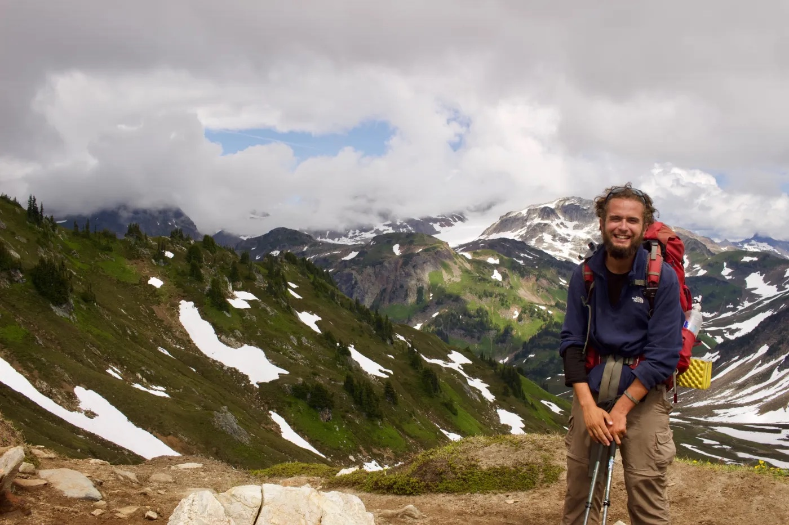
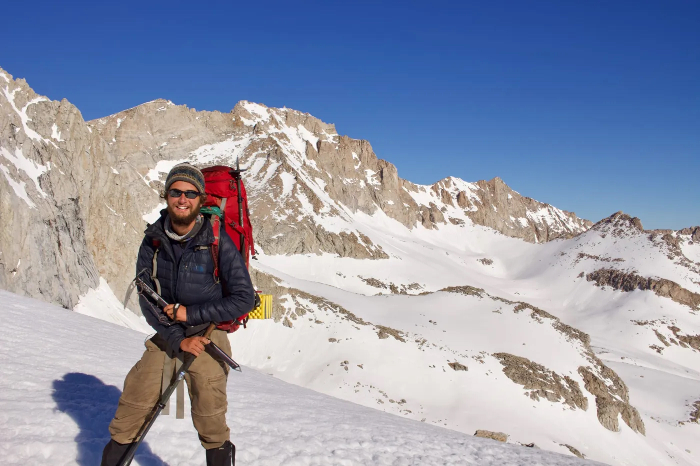

When I’m not working, I’m an avid international climber and backpacker!

I'm currently planning a week-long trip along the Alaskan Brooks Range and a solo 90 mile thruhike of the [Pfiffner Traverse](https://andrewskurka.com/adventures/pfiffner-traverse-colorado-rockies/) next summer. 

Some past backpacking and climbing highlights include:
- a 20,000 ft. climb in Bolivia of Huayna Potosi
- 1,250 mile trip along the Pacific Crest Trail in California and Washington
- 50 mile off-trail trek through the southern Sierra Nevadas
- 90 mile trek along the Continental Divide Trail in Wyoming's Wind Rivers  
- 6 month road trip around the United States through 36 states ([featured in the New York Times](https://www.nytimes.com/2020/08/14/fashion/weddings/perfectly-in-sync-during-a-35-state-road-trip-and-a-1200-mile-hike.html))
- 42 mile hike completed in 17 hours through New Mexico's Sangre De Cristos
- 32 mile hike completed in 18 hours around the circumference of Manhattan, NY
- Traveled to more than 30 countries
- Working as a professional backpacking guide in New Mexico
- Three weeks rock climbing in Wyoming with the NOLS
- Former NOLS Wilderness First Responder/Nationally Certified EMT/B

