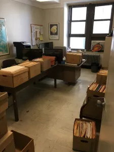

Network analysis shows connections between disparate elements within sets.

Academics have long known that gun violence across communities is generally not random. Researchers have found that only 1% of the population is responsible for 63% of the violence across the United States (Falk, 2014). The Crime Strategies Unit has found similar results in our analysis of gun violence in Raytown, Missouri.

<iframe id="advanced_iframe" name="advanced_iframe" src="https://kcpdclearance.firebaseapp.com/LinkagesForGraph.html" width="100%" height="600" frameborder="0" allowtransparency="true" loading="lazy" style=";width:100%;height:600px;"></iframe>

We looked at every homicide, non-fatal shooting, and robbery from 2017 through mid-2020 in Raytown, going through thousands of pages of police reports. Below, is a representation of that linked violence. Green dots are homicides, purple dots are non-fatal shootings, and orange dots are the people who are associated with those events. You’ll be able to see an incredible clustering where a few individuals are associated with multiple serious gun crimes. Violent crimes are very rare in American society (Kansas City, with one of the highest rates in the country, had only 35 homicides per 100,000 residents). People involved in multiple homicides are not just randomly unlucky. The question becomes why do they appear at scenes so often, and how can our community intervene before the next gun crime occurs. I made the above network with WebWeb, an open-source Python library along with Pandas.

Network analysis is also very helpful in in individual case analysis. People leave digital trails every day that law enforcement can use to prove these connections. These trails can come from Facebook, phone records, or any dataset that uses linked nodes.

While working on a double homicide trial, we recognized that we would need independent corroboration. These boxes are full of paper beeper records from Sprint cell phones back in 2007. I digitized them all into a database of thousands of numbers and tens of thousands of phone calls, then used them to visualize the network. I paired the names associated with each phone number to the actual call records, creating a timeline of the night’s events. These phone records and corresponding social network model provided that independent corroboration that confirmed every witness statement. At the trial, the network and phone records proved to be persuasive evidence.
